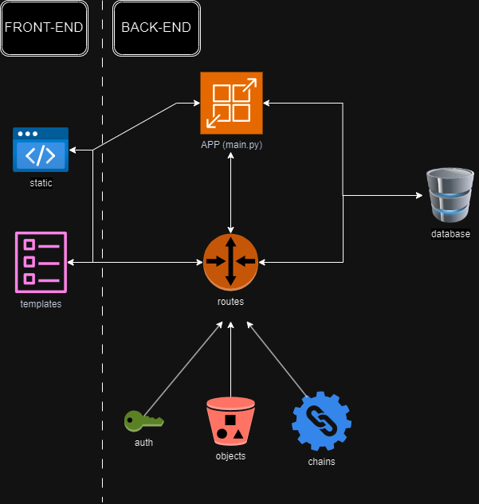

# LLM FLASHCARDS APP 
This prototype app aims revolutionize flashcard learning by enabling users to generate custom flashcard decks for an enhanced and personalized practice experience. Break free from conventional flashcard usage and unleash your creativity with our innovative approach.

The app is designed with a front-end agnostic architecture, utilizing FastAPI for robust backend performance. It leverages Langchain for efficient LLM chaining, complemented by streamlined vanilla HTML/JS/CSS for the front-end.

Front-end agnostic FastAPI app benefiting from Langchain for LLM chains and vanilla HTML/JS/CSS for front-end.

**Readme Contents**
- 1.0 Stack
- 1.1 Installation
- 1.2 Usage
- 1.3 Understanding the Codebase

## 1.0 Stack
- Python, SQL, Javascript, HTML, CSS
- FastAPI, langchain, uvicorn, fastapi, passlib, Jinja2, python-multipart, python-dotenv, openai, bcrypt

## 1.1 Installation
1. Clone the repository: `git clone https://github.com/Safakan/LLM-Flashcards-FastAPI.git` or via the GitHub Desktop app.
2. Install the required dependencies: `pip install -r requirements.txt` (ideally in a virtual environment)

OR
1. Create a docker container using the Dockerfile.

## 1.2 Usage
1. Ensure you are in the root directory and have a .env file with your "OPENAI_API_KEY" set to your private key.
 - Confirm that the API key is correctly set in the environment.
2. Run the application: `uvicorn main:app --reload`
3. Wait for the application to run on your browser.
4. Register/Login to use.
5. Give AI a prompt to generate you a deck of cards.
 - AI is accustomed to generate you a deck of cards, just give it a context and tell what you want.

## 1.3 Understanding the Codebase
The app runs from the single file main.py in the root directory, the rest in the diagram below are sub-directories of the repository. Modularized codebase aims to provide clear links within the application. Read the each section below to understand it in depth.

###  root (directory)
- main.py, readme.md, requirements.txt, test.db, LICENSE, git and docker files
- ./main.py (app)
 - Runs the app itself.
  - The environment variables are loaded.
  - Ensures the database schema is prepared before the application starts serving requests.
  - Adds all the routes and endpoints defined in routes(web.py) to the main application.
  - Mounts a directory to serve static files in a FastAPI application

### templates (directory)
- Has the template html templates to be served e.g index.html

### static (directory)
- Has two sub-directories to handle static file serving
 - js - has independent javascript modules to be used.
 - styles - has independent css modules for styling.

### routes (directory)
- Main place to handle endpoints. Currently there's only a single file:
 - web.py has the router set up with all endpoints and the jinja templates

### database (directory)
- database/models.py
 - contains all the data models

- database/database.py
 - connection to the database

- database/query_database.py
 - Database Query CLI Tool to query the database.
  - python .\query_database.py --query "Select * from users"
  - python .\query_database.py --file .\query.sql

### auth (directory)
- auth/authentication.py
 - Handles password and user verification / hashing

### chains (directory)
- chains/create_deck_from_input.py
 - Handles LLM chain to generate a deck from a text input in JSON format to be processed later on.

### objects (directory)
- A directory to store abstract objects that will have complex utilities in the app.
 - currently there's only active_deck.py

### docs (directory)
- Anything related to documentation will be stored here.